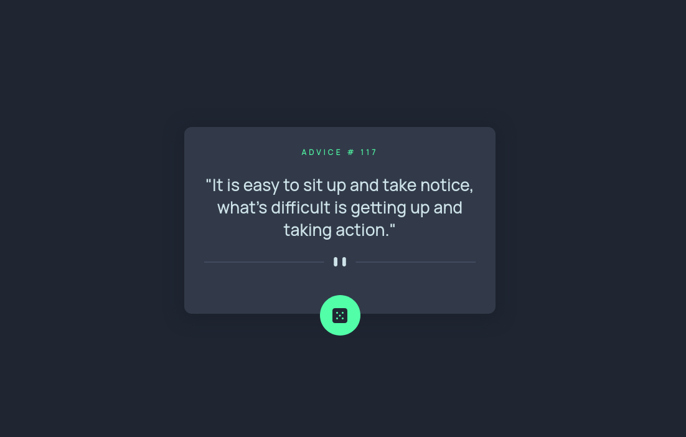

# Frontend Mentor - Advice generator app solution

This is a solution to the [Advice generator app challenge on Frontend Mentor](https://www.frontendmentor.io/challenges/advice-generator-app-QdUG-13db).

## Table of contents

- [Overview](#overview)
  - [The challenge](#the-challenge)
  - [Screenshot](#screenshot)
  - [Links](#links)
- [My process](#my-process)
  - [Built with](#built-with)
  - [Useful resources](#useful-resources)

## Overview

### The challenge

Users should be able to:

- View the optimal layout for the app depending on their device's screen size
- See hover states for all interactive elements on the page
- Generate a new piece of advice by clicking the dice icon

### Screenshot

### Links

- Solution URL: [Frontendmentor solution](https://www.frontendmentor.io/solutions/responsive-design-using-flexbox-and-scss-OBHIZYiitk)
- Live Site URL: [Netlify](https://ns-advice-netlify.com)

## My process

### Built with

- Semantic HTML5 markup
- SCSS custom properties
- Flexbox
- Mobile-first workflow
- [Advice API](https://api.adviceslip.com/) - API for generating advice slips

### Useful resources

- [CSS Position in 9 minutes](https://www.youtube.com/watch?v=jx5jmI0UlXU&ab_channel=WebDevSimplified) - Amazing video on CSS positions
